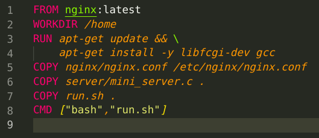
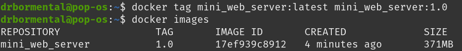

## Part 1. Ready-made docker
1. `nginx` image download with `docker pull`

    

1. Check docker images:
   
    

1. Run the docker image, check that it's running and inspecting it:

    

1. Data from the `inspect` output:
    + `size` is `1095`
    + only one `port` is mapped: `80/tcp` to null
    + `ip adress` is `172.17.0.2`
    
    

    

    

1. Stop the docker image and check that it's stopped:

    

1. Run the `nginx` image with mapped ports:

    

1. Check if the `nginx` start page is available:

    

1. Restart and check that it's running:

    

## Part 2. Operations with container

1. Contents of the `nginx.conf` configuration file inside the docker container:

    

1. Local `nginx.conf` file with the `/status` path configured (commented the default settings with `#include /etc/nginx/conf.d/*.conf`):

    

1. Copy the local file to the docker container and restart the service:

    

1. Check `localhost:80/status` page:

    

1. Export and stop the container:

    

1. Docker won't let us delete an image if it is used by a container. We can use `-f` flag to force it to remove:

    

1. Delete the stopped container:

    

1. Import the container back:

    

1. Run the imported container:

    

1. Check that `localhost:80/status` returns the nginx server status page:

    

## Part 3. Mini web server

1. The source file of the mini web server in `C` and `FastCgi` located in the [mini_server.c](./server/mini_server.c) file. It will return a simple page saying `Hello World!` on every request from `127.0.0.1:8080`. It needs to be compiled with the `gcc` compilator in order to use it:

    `gcc -Wall -Wextra -Werror server/mini_server.c -lfcgi -o server/mini_server`:

    

1. Create an nginx config that will proxy all requests from port `81` to the server on `127.0.0.1:8080`:

    

1. Use the official `nginx` docker image to run the mini web server in a container.

    Run the container, copy the files to it and restart the `nginx` service:

    

1. Run an interactive shell on the container and install necessary tools to run the server with commands:

    + `apt-get update`
    + `apt-get install libfcgi-dev`

    

1. Run the `server`:

    

1. Check that it's working:

    

## Part 4. Your own docker

1. Create a [docker file](./Dockerfile) (base on the official nginx image) which:

    + builds mini server sources on `FastCgi`
    + runs it on port `8080`
    + copies inside the image written `./nginx/nginx.conf`
    + runs `nginx`

    

    The [script](./run.sh), used in the docker file:

    

1. Now we can build it and check that it's created:

    

    

1. Next run the image with mappings and check that the web server is working:

    

    

1. Add proxying of `/status` page in `./nginx/nginx.conf` to return the nginx server status:

    

1. Restart the container:

    

1. Check that the `/status` page is working

    

## Part 5. Dockle

1. Check the image with dockle:

    

1. Add clean up command and command to set the user to fix the second error and the first warning:

    + `rm -rf /var/lib/apt/lists`
    + `USER nginx`

    

1. Change the tag to fix the second warning:

    

1. Since the official `nginx` image is used there is no way to directly fix the first error, so the `-ak` flag is used to suppress it:

    
